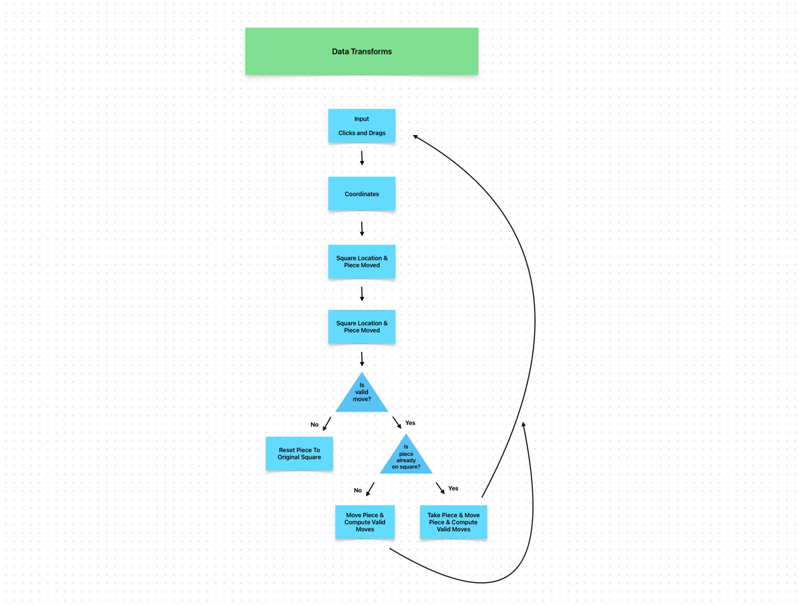

# Planning & Design for Chess Engine

---

## Data Transformations

- Board split into array of 8 arrays (because statistically, the access of the data will be more in certain rows like
the first two rows of each color piece

Click & Drags -> Coordinate -> Square Location & Piece Moved -> Check if Valid -> (if no, reset) (if yes, move piece & compute valid moves)

### Input - Clicks and Drags

ImGui for UI and displaying images

GLFW for the window

### Coordinates

Input: Mouse Coordinate

Determine the square based on the mouse coordinates given by ImGui/GLFW

