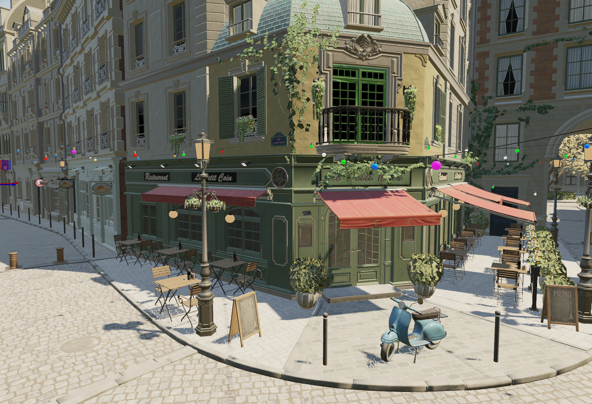

# Astral Engine

[](https://github.com/Sparky015/AstralEngine/actions/workflows/cmake-multi-platform-development-ci.yml)

---------------
Welcome to the Astral Engine project codebase!

This project is a Work-In-Progress with no official first release.

It is continuously being updated and improved as I can get to more things.

Project Lifetime: April 2024 - Present

In the future, Astral Engine will become a 3D engine targeting open world environments with focus on particles
and the environment, but there is a lot of stuff to do to get there.

### Notable Features

----

* Physically-Based Vulkan HDR Renderer 

Created a Vulkan based renderer that uses the Cook-Torrence BRDF to implement physically based rendering as well as Image
Based Lighting for the environment. The renderer supports two modes, forward and deferred. The forward renderer consists 
of a pre depth pass, cascaded shadow map pass, lighting pass, environment map pass, tone mapping pass, and the deferred renderer consists of a 
geometry pass, cascaded shadow map pass, lighting pass, environment map pass, tone mapping pass, and FXAA pass. Forward uses MSAA x4 while
deferred uses FXAA (looking into TAA in the future). Additionally, both paths use compute shaders to calculate irradiance
and prefiltered environment maps one time for each environment map that is set.

* Frame/Render Graph

Designed and implemented Frame/Render Graph to manage render pass resources and execution as well as memory barriers for 
synchronization. The Frame Graph allows the user to define any render passes and attachment specs for each render pass, and
the Frame Graph will create all the necessary textures, render passes, frame buffers, and descriptor sets for each render pass,
and facilitate the synchronization needed between render passes. It also culls any render passes that don't contribute
to the final output image. The user can also recreate the Render Graph as many times as they want during rendering
and the render graph will manage the creation of new resources the user requested as well as making sure the resources 
being used on the GPU do not get deleted.

* Renderer Hardware Interface (RHI)

Created an abstraction layer to manage renderer API usage in order to support multiple rendering APIs in the future
(looking into implemented DX12 in the future) and allow for easy API usage for higher level systems while allowing for
switching APIs without any diverging code in the high level systems.

* Editor 

Built an editor that I can compose new game scenes with and allow for saving scenes and switching to different scenes without using a
different executable. Users can compose scenes by adding and removing entities, adding components to entities and changing
entity component data, changing environment settings like the environment map, exposure and ambient light modifier, changing 
camera properties, and more!

* Scene System 

Designed and implemented a scene system that will allow users to compose scenes with entities, environment maps, and more 
and save the scene to a file and load scenes from files. Right now it is loading whole scenes at a time and storing them
in the asset cache, but in the future, I will implement a way to unload scenes from the asset cache.

* Asset Manager 

Created an asset manager that can load in assets from files and cache their data to improve loading times
and memory efficiency. Currently, the asset loads are single threaded, but in the future, I want to look into 
multithreaded asset loading to improve loading times as well as not blocking the main thread in order to have a 
smooth UI/UX.

* Academy Color Encoding System (ACES) Color Workflow

ACES 2.0 has been implemented for high quality color management, resulting in more vibrant and accurate colors. 
All rendering is done in the ACEScg space with the ACES filmic look being applied. For the input display transform, all 
color inputs being converted from sRGB to AP1 primaries to place them in the ACEScg space. After rendering is done, 
I use a OCIO baked lut that contains the Reference Rendering Transform and the Output Display Transform which converts
the final colors from the ACEScg space to the sRGB space with gamma applied while also applying tone mapping for standard
dynamic range displays.

#### Custom Allocators (Experimental Proof of Concept)

This includes tailored allocators for the engine to help reduce allocations where it is possible and improve performance
when the situation allows for it.

A list of the custom allocators follows:
Stack allocator, linear allocator, custom alignment allocator, frame allocator, double buffered allocator, pool allocator,
ring allocator/buffer, and stack-based linear allocator (plus an object pool class).

You can find more detailed information about this (including the why's) [here](Documentation/Astral-Runtime/Core/Memory%20Allocators/Information.md).

Future allocators to be written: Slab Allocator

- Note that I am still polishing this feature, but it is functionally done.

#### Memory Profiling Tool Suite (Experimental)

This includes real time memory allocation stats, a scene-based memory profiling with file exports and visualizer tool, 
and scope-based allocation profiling tool.

You can find more detailed information about this (including the why's) [here](Documentation/Astral-Runtime/Profiling%20Tools/Memory%20Tracking%20&%20Visualization/Information.md).

- Note that this is only available in debug builds, and that I am still polishing and optimizing this feature, but it is functionally done.

#### Visual Scope Profiler

This provides the user a macro to profile a scope to know how long it takes to complete as well as how many allocations
took place in the scope. It then outputs this data to a json file that can be loaded into Chrome's trace tool or perfetto's
trace tool to view visually.

#### Entity-Component-System (ECS) 

Created a entity component system to compose scenes with entities that you can attach data components to, and every frame,
a system will operate on entities with certain component types. Right now, it is a basic implementation to get things up 
and running, but in the future, I want to implement sparse sets into the ECS for better performance when it is necessary.

View the planning documentation [here](Documentation/Astral-Runtime/ECS/)


### Screenshot of Current Engine State

---



This picture contains the Amazon Lumberyard Bistro sample in the Editor. This is from the feature-cascaded-shadow-maps branch!

### Roadmap

-----

1. The below TODO Render Passes
2. Native Scripting
3. Multithreaded Asset System
4. Rendering Thread
5. GPU Particle System
6. Volumetric Lighting


### TODO Render Passes

* SSAO
* Omni-Directional Shadow Maps
* Transparent Objects Forward Pass
* Bloom
* SMAA
* TAA
* Tiled Light Culling


### How to Build

-----

Supported Compilers: MSVC, AppleClang, and Clang
Supported Platforms: Windows and macOS    (Linux coming in the future)

Astral uses CMake for the build system.

In addition to the methods below, you can also use an IDE that supports building with CMake like CLion or Visual Studio. Before running the project,
make sure to switch the target to your desired target that you want to run.

Requirements include:
- git
- Python 3.x 
- Vulkan SDK
- CMake ver. 3.28+ (Note: The below examples require cmake to be available on the command line)
- A supported C++20 compiler
- 64-bit CPU

Note: The project will not build without the Vulkan SDK installed on your computer. You will also need the debug versions of the libraries installed.
      The version needed is 1.3.296.0. You can run the CheckVulkanSDK.py script (in the Scripts folder) to see if you have the libraries needed present and the correct Vulkan SDK version installed.

**Important Other Note**: There are some quirks being ironed out as I develop the engine. Currently, there are a few bugs to be aware if you run the engine. Firstly, shadows will not work correctly with frustum culling turned on. The main geometry pass and
shadow map pass currently use the same list of geometry to draw, so any culling also affects the shadow map pass (Temp. fix: Turn off frustum culling). On macOS, attempting to turn off VSync will cause a crash (Temp. Fix: Do not try to turn off vsync if building from macOS)


Use ```git clone --recursive https://github.com/Sparky015/AstralEngine.git``` to download the project. Do not use the 'Download Zip' option!

#### Windows

1. Open a terminal at the root of the project
2. Enter the following shell code to build the project
   ```powershell
   mkdir build
   cd build
   cmake -DCMAKE_BUILD_TYPE=Release ..
   cmake --build .
   ```
   Note that the default build is release. If you want a debug build, change the Release
   to a Debug in this line -> cmake -DCMAKE_BUILD_TYPE=[Desired Build Config] ..
3. Navigate to the bin directory
   ```powershell
   cd bin
   ```
4. Choose which executable you want to run
   ```powershell
   dir
   .\[enter_executable_name].exe
   ```
   Note that to use the executables containing unit tests, you must build them as a debug build


#### MacOS

1. Open a terminal at the root of the project
2. Enter the following shell code to build the project
   ```bash
   mkdir build
   cd build
   cmake -DCMAKE_BUILD_TYPE=Release ..
   cmake --build .
   ```
   Note that the default build is release. If you want a debug build, change the Release
   to a Debug in this line -> cmake -DCMAKE_BUILD_TYPE=[Desired Build Config] .. 
3. Navigate to the bin directory
   ```bash
   cd bin
   ```
4. Choose which executable you want to run
   ```bash
   ls
   ./[enter_executable_name]
   ```
   Note that to use the executables containing unit tests, you must build them as a debug build 


### Branches

-----

- main --> The branch for releases   (no actual releases have happened yet)
- development -> All work is done in this branch or a branch based from it
- feature-X -> Branches for feature work to be done on
- experimental-X -> Branches for to explore the potential and limits of a new feature idea


### Dependencies and Third Party Libraries

-----

- GLFW: For a cross-platform window
- GLAD: For loading OpenGL 
- cpuinfo: For detecting the cpu name, amount of cores, and other info
- glm: For math 
- googletest: For unit testing
- imgui: For debug menus and the editor UI
- ImPlot: For graphing memory profiling data
- msgpack: For serialization and deserialization
- stb_image: For loading image files
- cpptrace: For generating stacktraces (temporary, waiting for C++23 stacktraces to be implemented)
- nativefiledialog-extended: For native file dialog windows on macOS and Windows
- Half: For half float support
- gli: For loading .ktx and .dds files
- ImGuizmo: For gizmos in the editor for things like moving entities or rotating them
- yaml-cpp: For saving things like material files to disk (scene files in the future)


### Current C++ Version (C++20)

-----

This project is using C++20 currently and mainly for [[unlikely]], [[likely]], consteval, and constexpr improvements (maybe modules in the future).


I am looking to switch to C++23 when the stacktraces feature is actually implemented by
all the major compilers. Also, std::unreachable would be useful.


### Testing Environment

---- 

#### Tested IDEs:

macOS: CLion and Xcode     
Windows: CLion and Visual Studio   

#### Hardware used for Testing: 

macOS is tested using a MacBook M1 Pro       
Windows is tested using a PC with a Ryzen 5600X and Nvidia RTX 3070 Ti

#### Tested Compiler Versions:

MacOS: AppleClang 16.0.0, Clang 19.1.7      
Windows: MSVC 19.43
